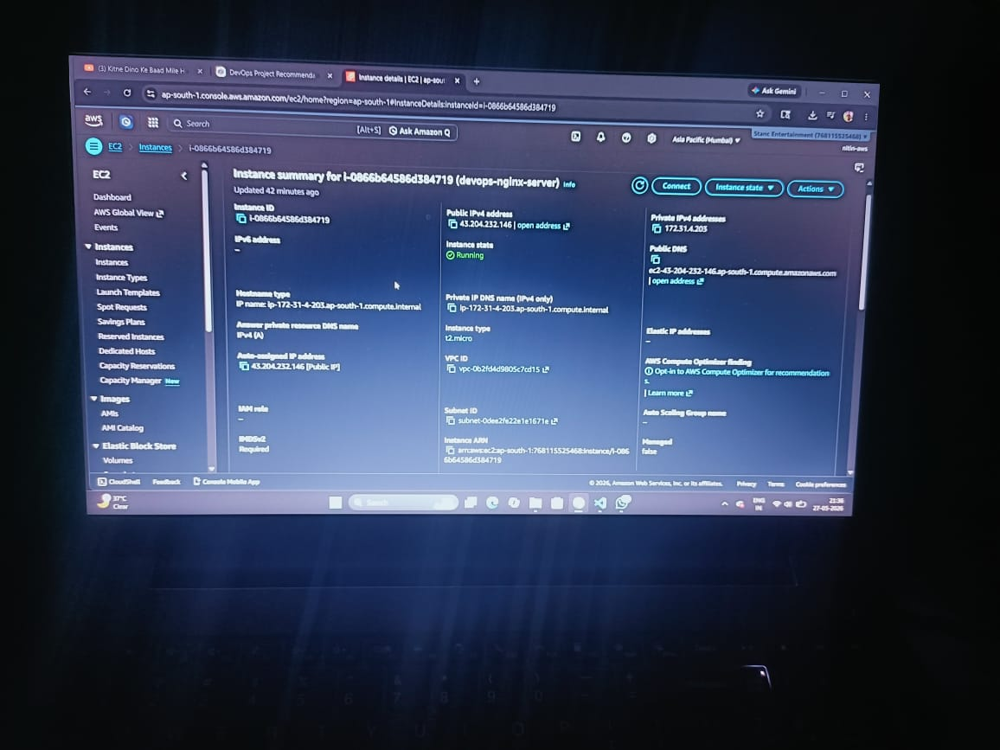
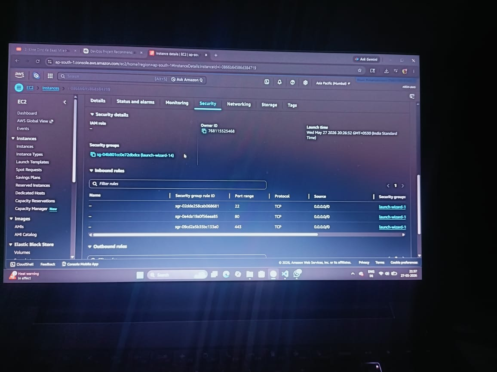

# AWS EC2 Nginx Deployment

## Technologies Used
- AWS EC2
- Ubuntu Linux
- Nginx
- SSH

## Project Overview
This project demonstrates deployment of a static website on AWS EC2 using Nginx.

## Architecture
User Browser → AWS EC2 → Nginx

## Screenshots

### EC2 Instance Running

### Security Group Rules

### SSH Connection

### Nginx Running

### Website Live
